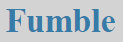

<a name="readme-top"></a>


[![MIT License][license-shield]][license-url]
[![LinkedIn][linkedin-shield]][linkedin-url]


<!-- PROJECT LOGO -->
<br />
<div align="center">
  <a href="https://github.com/PeanutButterRat/Fumble">
    
  </a>

  <h3 align="center">Fumble</h3>

  <p align="center">
    A full-stack Flask-based web-messaging application. 
    <br />
    <br />
    <a href="#demo">View Demo</a>
    ·
    <a href="https://github.com/PeanutButterRat/Fumble/issues">Report Bug</a>
    ·
    <a href="https://github.com/PeanutButterRat/Fumble/issues">Request Feature</a>
  </p>
</div>


<!-- TABLE OF CONTENTS -->
<details>
  <summary>Table of Contents</summary>
  <ol>
    <li>
      <a href="#about-the-project">About The Project</a>
      <ul>
        <li><a href="#built-with">Built With</a></li>
      </ul>
    </li>
    <li>
      <a href="#getting-started">Getting Started</a>
      <ul>
        <li><a href="#prerequisites">Prerequisites</a></li>
        <li><a href="#installation">Installation</a></li>
      </ul>
    </li>
    <li><a href="#usage">Usage</a></li>
    <li><a href="#contributing">Contributing</a></li>
    <li><a href="#license">License</a></li>
    <li><a href="#contact">Contact</a></li>
    <li><a href="#acknowledgments">Acknowledgments</a></li>
    <li><a href="#demo">Demo</a></li>
  </ol>
</details>


<!-- ABOUT THE PROJECT -->
## About The Project

[![Fumble Screen Shot][product-screenshot]](/asset/login.png)

Fumble is a web-based messaging platform that uses Flask and SocketIO for real-time group messaging. I built it to get more full-stack experience under my belt and get more comfortable utilizing web services. At the end, I deployed it to a free AWS instance to round out the project with a bit of DevOps experience as well. 

It's not going to revolutionize the world, but it was pretty cool to end up with a functional web application that I built myself. Further down, you can see a demo where I test it out with a couple of my colleagues while running on AWS.

<p align="right">(<a href="#readme-top">back to top</a>)</p>


### Built With

Here are the technologies, tools, and services I used to create the project.

* [![Python][Python]][Python-url]
* [![HTML][HTML]][HTML-url]
* [![CSS][CSS]][CSS-url]
* [![Flask][Flask]][Flask-url]
* [![SQLite][SQLite]][SQLite-url]
* [![AWS][AWS]][AWS-url]

<p align="right">(<a href="#readme-top">back to top</a>)</p>


<!-- GETTING STARTED -->
## Getting Started

This is an example of how you may give instructions on setting up your project locally.
To get a local copy up and running follow these simple steps.

### Prerequisites

Fumble is pretty simple and only needs Python to run the backend. Download and install Python 3 from [https://www.python.org/](https://www.python.org/).

### Installation

1. Clone the repo
   ```sh
   git clone https://github.com/PeanutButterRat/Fumble.git
   ```
2. Install Python packages
   ```sh
   pip install .
   ```
3. Initialize an empty database
   ```sh
   flask --app fumble init-db
   ```
3. Start the Flask application
   ```sh
   flask --app fumble run --debug
   ```
4. Once Fumble is up and running, visit [http://127.0.0.1:5000](http://127.0.0.1:5000) to start using it!

_Note: Although Flask will be running locally, you can still play around with simulating multiple users in the same browser by using incognito tabs (CTRL + SHIFT + N on Chrome)._ 

<p align="right">(<a href="#readme-top">back to top</a>)</p>


<!-- USAGE EXAMPLES -->
## Usage

To start chatting, first navigate to the top right link to create an account. After doing so, you will automatically be redirected to log in.

[Log In](/assets/login.png)

Once you are on the main dashboard, you can click a room to join one that is already created or make a new one.

[Rooms](/assets/login.png)

Once you are in a room, just type a message to send it to everyone else!

[Chat](/assets/chat.png)


_For more examples, please refer to the [Documentation](https://example.com)_

<p align="right">(<a href="#readme-top">back to top</a>)</p>


<!-- CONTRIBUTING -->
## Contributing

If you have a suggestion that would make this better, please fork the repo and create a pull request. You can also simply open an issue with and present your idea there. I don't forsee anyone feeling inspired enough to contribute, but any contributions are greatly appreciated if you do decide to!

1. Fork the Project
2. Create your Feature Branch (`git checkout -b feature/AmazingFeature`)
3. Commit your Changes (`git commit -m 'Add some AmazingFeature'`)
4. Push to the Branch (`git push origin feature/AmazingFeature`)
5. Open a Pull Request

<p align="right">(<a href="#readme-top">back to top</a>)</p>


<!-- LICENSE -->
## License

Distributed under the MIT License. See `LICENSE.txt` for more information.

<p align="right">(<a href="#readme-top">back to top</a>)</p>


<!-- CONTACT -->
## Contact

Eric Brown - [GitHub](https://github.com/PeanutButterRat) - ebrown5676@gmail.com

Project Link: [https://github.com/PeanutButterRat/Fumble](https://github.com/PeanutButterRat/Fumble)

<p align="right">(<a href="#readme-top">back to top</a>)</p>


<!-- ACKNOWLEDGMENTS -->
## Acknowledgments

Here are some awesome resources that were crucial to the development to this application.

* [Awesome Badges](https://dev.to/envoy_/150-badges-for-github-pnk)
* [README Template](https://github.com/othneildrew/Best-README-Template)
* [Flask Tutorial](https://flask.palletsprojects.com/en/2.3.x/tutorial/)
* [SocketIO](https://socket.io/)
* [Flask-SocketIO](https://flask-socketio.readthedocs.io/en/latest/)

<p align="right">(<a href="#readme-top">back to top</a>)</p>


[license-shield]: https://img.shields.io/github/license/othneildrew/Best-README-Template.svg?style=for-the-badge
[license-url]: https://github.com/PeanutButterRat/Fumble/LICENSE
[linkedin-shield]: https://img.shields.io/badge/-LinkedIn-black.svg?style=for-the-badge&logo=linkedin&colorB=555
[linkedin-url]: https://www.linkedin.com/in/eric-brown-b0a258202/

[product-screenshot]: images/screenshot.png

[Flask]: https://img.shields.io/badge/Flask-000000?style=for-the-badge&logo=flask&logoColor=white
[Flask-url]: https://flask.palletsprojects.com/en/2.3.x/
[SQLite]: https://img.shields.io/badge/SQLite-07405E?style=for-the-badge&logo=sqlite&logoColor=white
[SQLite-url]: https://www.sqlite.org/index.html
[AWS]: https://img.shields.io/badge/Amazon_AWS-232F3E?style=for-the-badge&logo=amazon-aws&logoColor=white
[AWS-url]: https://aws.amazon.com/?nc2=h_lg
[Python]: https://img.shields.io/badge/Python-3776AB?style=for-the-badge&logo=python&logoColor=white
[Python-url]: https://www.python.org/
[HTML]: https://img.shields.io/badge/HTML-239120?style=for-the-badge&logo=html5&logoColor=white
[HTML-url]: https://developer.mozilla.org/en-US/docs/Learn/Getting_started_with_the_web/HTML_basics
[CSS]: https://img.shields.io/badge/CSS-239120?&style=for-the-badge&logo=css3&logoColor=white
[CSS-url]: https://developer.mozilla.org/en-US/docs/Web/CSS

<!-- DEMO -->
## Demo

https://github.com/PeanutButterRat/Fumble/blob/main/assets/demo.mp4

Press play to watch a short application demo.